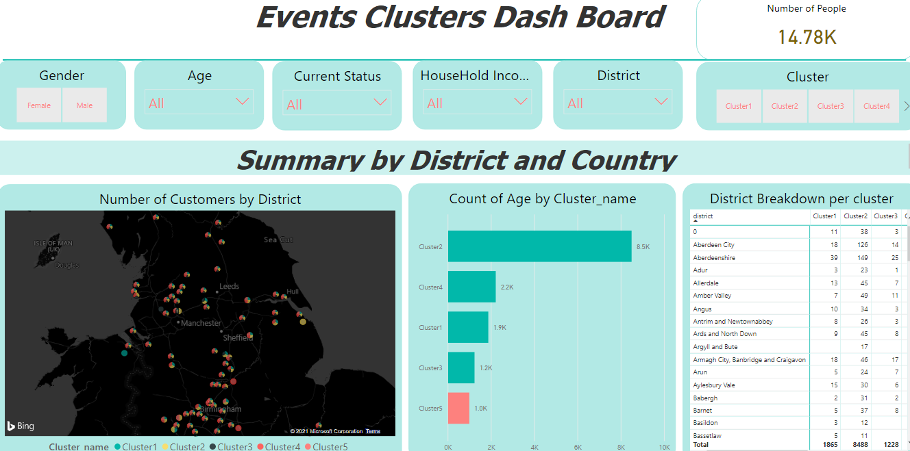
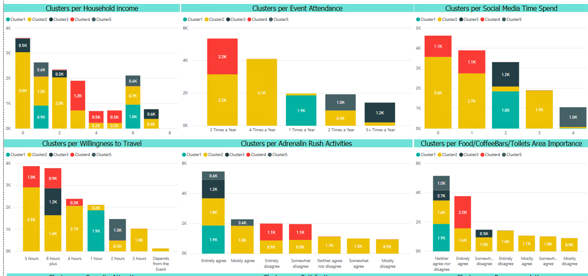

# Unsupervised-Learning

Here i have sepearted people and their intrests into 5 diffeernt clusters using Kmeans and PCA,after assinging people into clusters,i have created a csv file named
cleaned_data.csv,which i have used to generate the report using PowerBi,here is a glimpse of the report ↓

